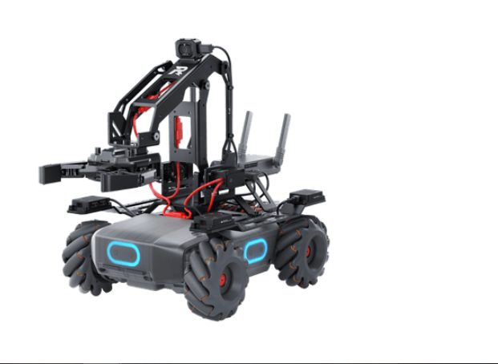
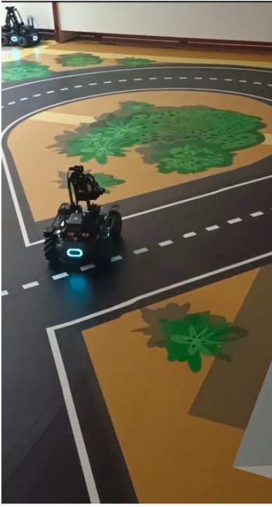
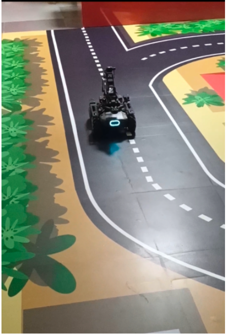

# MobileRobot-Openloopcontrol
## Aim:

To develop a python control code to move the mobilerobot along the predefined path.

## Equipments Required:
1. RoboMaster EP core
2. Python 3.7

## Procedure

Step1: Start
Step2: From robomaster import robot
Step3: Initialize the type
Step4: Run the program to move the robo moster through our condition
Step5: ClosE
Program
import time

if __name__ == '__main__':
    ep_robot = robot.Robot()
    ep_robot.initialize(conn_type="ap")

    ep_chassis = ep_robot.chassis

## robomaster import robot
import time

def sub_info_handler(batter_info, ep_robot):
    percent = batter_info
    print("Battery: {0}%.".format(percent))

if _name_ == '_main_':
    ep_robot = robot.Robot()
    ep_robot.initialize(conn_type="ap")

    ep_battery = ep_robot.battery

    ep_battery.sub_battery_info(5, sub_info_handler, ep_robot)
    time.sleep(10)
    ep_battery.unsub_battery_info()
    print("Completed ...")
    ep_robot.close()
[## from robomaster import robot
import time

if _name_ == '_main_':
    ep_robot = robot.Robot()
    ep_robot.initialize(conn_type="ap")

    ep_chassis = ep_robot.chassis

    '''
    x = speed in x direction( meter/second) [-3.5,3.5]
    y = speed in y direction( meter/second) [-3.5,3.5]
    z = rotation about z axis ( degree/second)[-600,600]
    '''
    ep_chassis.drive_speed(x=0.1,y=0.1,z=30)
    time.sleep(20)
    ep_chassis.drive_speed(x=0.1,y=0.2,z=10)

    ep_robot.close()
## from robomaster import robot
import time

if _name_ == '_main_':
    ep_robot = robot.Robot()
    ep_robot.initialize(conn_type="ap")

    ep_led = ep_robot.led
    '''
    comp – enum: (“all”, “top_all”, “top_right”, “top_left”, “bottom_all”, “bottom_front”, “bottom_back”, “bottom_left”, “bottom_right”) lighting parts, all: all armor lights ;top_all: all armored lights of the gimbal; top_right: armored lights on the right side of the gimbal; top_left: armored lights on the left of the gimbal; bottom_all: all armored lights on the chassis; bottom_front: front armored lights; bottom_back: rear armored lights; bottom_left: left armored lights light; bottom_right: right armor light
    r – int: [0~255], RGB red component value
    g – int: [0~255], RGB green component value
    b – int: [0~255], RGB blue component value
    effect – enum: (“on”, “off”, “flash”, “breath”, “scrolling”) lighting effect type, on: always on; off: always off; flash: blinking; breath: breathing; scrolling: horse racing Lamp (only valid for PTZ lamp)
    '''
    for i in range(10):
        ep_led.set_led(comp="all",r=255,g=255,b=255,effect="on")   
        time.sleep(2)
        ep_led.set_led(comp="all",r=255,g=255,b=0,effect="on")
        time.sleep(2)
        ep_led.set_led(comp="all",r=255,g=0,b=255,effect="on")
        time.sleep(2)     
    
    print("Completed...")
    ep_robot.close()
## from robomaster import robot
import time

if _name_ == '_main_':
    ep_robot = robot.Robot()
    ep_robot.initialize(conn_type="ap")

    ep_chassis = ep_robot.chassis

    '''
    x = x-axis movement distance,( meters) [-5,5]
    y = y-axis movement distance,( meters) [-5,5]
    z = rotation about z axis ( degree)[-180,180]
    xy_speed = xy axis movement speed,( unit meter/second) [0.5,2]
    '''
    ep_chassis.move(x=2.4, y=0, z=0, xy_speed=0.75).wait_for_completed()

    ep_chassis.move(x=0, y=0, z=45, xy_speed=1).wait_for_completed()

    ep_chassis.move(x=2.4, y=0, z=45, xy_speed=0.75).wait_for_completed()

    ep_chassis.move(x=1, y=0, z=45, xy_speed=0.75).wait_for_completed()

    ep_chassis.move(x=0.5, y=0, z=45, xy_speed=0.75).wait_for_completed()

    ep_robot.close()
## from robomaster import robot
  import time
from robomaster import camera

if _name_ == '_main_':

    ep_robot = robot.Robot()
    ep_robot.initialize(conn_type="ap")

    ep_chassis = ep_robot.chassis

    '''
    x = speed in x direction( meter/second) [-3.5,3.5]
    y = speed in y direction( meter/second) [-3.5,3.5]
    z = rotation about z axis ( degree/second)[-600,600]
    '''
    ep_camera = ep_robot.camera

    print("Camera streaming started...")
    ep_camera.start_video_stream(display=True, resolution=camera.STREAM_360P)    
    
    ep_chassis.move(x=2.4, y=0, z=0, xy_speed=0.75).wait_for_completed()

    ep_chassis.move(x=0, y=0, z=45, xy_speed=1).wait_for_completed()

    ep_chassis.move(x=2.4, y=0, z=45, xy_speed=0.75).wait_for_completed()

    ep_chassis.move(x=1, y=0, z=45, xy_speed=0.75).wait_for_completed()

    ep_chassis.move(x=0.5, y=0, z=45, xy_speed=0.75).wait_for_completed()

    ep_chassis.move(x=0, y=-2, z=0, xy_speed=0.75).wait_for_completed()

    ep_chassis.move(x=2, y=0, z=0, xy_speed=0.75).wait_for_completed()
    
    ep_camera.stop_video_stream()
    print("Stopped video streaming...")
    
    ep_robot.close()

   ### MobileRobot Movement Image:
   
   ### staring point of robot movement image.
   
   ### Ending point of robot movement image.
   
   ### MobileRobot Movement Video:
   Upload your video in Youtube and paste your video-id here

   link :https://youtube.com/shorts/5pnKTwwamx0?feature=share

  ### Result:
Thus the python program code is developed to move the mobilerobot in the predefined path.

Mobile Robotics Laboratory
Department of Artificial Intelligence and Data Science/ Machine Learning
Saveetha Engineering College